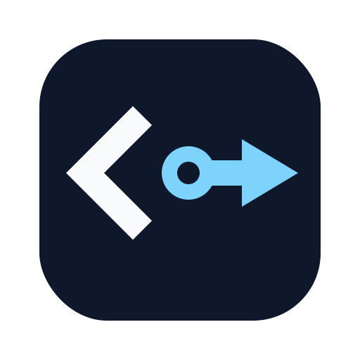

<div align="center">
  
  <h1>CLIProxyAPI Dashboard</h1>
  <p><strong>Proxy-only control plane for <a href="https://github.com/router-for-me/CLIProxyAPIPlus">CLIProxyAPIPlus</a></strong></p>
  <p>Next.js 16 / React 19 dashboard for provider credentials, proxy runtime settings, usage history, quotas, updates, logs, and safe container operations.</p>

  <p>
    <a href="https://github.com/quanpersie2001/cliproxyapi-dashboard/blob/main/LICENSE"></a>
  </p>

  <p>
    
    
    
    
  </p>

  <p>
    <a href="#quick-start">Quick Start</a>
    ·
    <a href="docs/README.md">Docs</a>
    ·
    <a href="docs/FEATURES.md">Features</a>
    ·
    <a href="#development-commands">Development</a>
  </p>
</div>

> [!IMPORTANT]
> The dashboard intentionally manages the proxy stack only. It is not a general product control plane and the bundled deployment keeps the dashboard and primary proxy API loopback-only by default.

## What It Covers

| Surface | What it covers |
| --- | --- |
| Access control | Dashboard users, admin access, session revocation, dashboard API keys |
| Provider management | Direct keys for Claude, Gemini, OpenAI/Codex, and OpenAI-compatible upstreams |
| OAuth inventory | Claude Code, Gemini CLI, Codex, Antigravity, iFlow, Kimi, Qwen Code, GitHub Copilot, Kiro, Cursor, CodeBuddy |
| Proxy operations | Routing, retries, logging, streaming, TLS, pprof, payload transforms, OAuth model aliases |
| Observability | Usage collection, quota views, logs, container state, and update workflows |

## Deployment Modes

| Mode | Use it when | Command |
| --- | --- | --- |
| Local appliance | You want the published dashboard image and bundled proxy stack running locally | `./setup-local.sh` |
| Source development | You want to run the dashboard from the checked-out source tree | `cd dashboard && ./dev-local.sh` |
| Server install | You want the bundled production compose stack on Ubuntu/Debian | `curl -fsSL .../install.sh | sudo bash` |

## Runtime Topology

The bundled deployment is a four-service Docker stack:

| Service | Role |
| --- | --- |
| `dashboard` | Next.js app, UI, API routes, JWT auth, Prisma access |
| `cliproxyapi` | CLIProxyAPIPlus runtime and management API |
| `postgres` | Persistent store for users, settings, audit logs, usage, and provider metadata |
| `docker-proxy` | Restricted Docker socket proxy for allowlisted container and image operations |

Operational boundaries:

- `dashboard/`: application code, Prisma schema, local source-dev workflow
- `infrastructure/`: production compose stack, runtime config, `manage.sh`, backup/restore ops, webhook helpers
- `docs/`: canonical documentation set

Default bundled endpoints:

- Dashboard: `http://127.0.0.1:3000`
- Proxy API: `http://127.0.0.1:8317`

OAuth callback ports remain published because upstream login flows require them.

## Quick Start

### 1. Local Appliance Setup

```bash
git clone https://github.com/quanpersie2001/cliproxyapi-dashboard.git
cd cliproxyapi-dashboard
./setup-local.sh
# Windows: .\setup-local.ps1
```

This creates a root `.env`, generates `config.local.yaml`, and starts the stack from [`docker-compose.local.yml`](docker-compose.local.yml). Then open `http://localhost:3000`, create the first admin user, connect providers, and issue client API keys.

Useful commands:

```bash
./setup-local.sh --down
./setup-local.sh --reset
```

### 2. Source Development

```bash
cd dashboard
./dev-local.sh
# Windows: .\dev-local.ps1
```

The source-dev workflow starts PostgreSQL and CLIProxyAPI in Docker, applies Prisma bootstrap and migrations, writes `dashboard/.env.local`, and runs `npm run dev`.

Source-dev endpoints:

- Dashboard: `http://localhost:3000`
- Proxy API: `http://localhost:28317`
- PostgreSQL: `localhost:5433`

### 3. Server Install

```bash
curl -fsSL https://raw.githubusercontent.com/quanpersie2001/cliproxyapi-dashboard/main/install.sh | sudo bash
```

The same `install.sh` file works in both modes:

- from a repo checkout: `sudo ./install.sh`
- as a one-file bootstrap: `curl .../install.sh | sudo bash`

When run as a one-file bootstrap, it downloads the bundled deployment files into `/opt/cliproxyapi-dashboard` by default, preserves existing runtime state files when re-run, and then continues the interactive installer.

The installer accepts either full URLs like `https://dash.example.com` or bare hostnames like `dash.example.com`, and normalizes them automatically.

To install into a different path:

```bash
curl -fsSL https://raw.githubusercontent.com/quanpersie2001/cliproxyapi-dashboard/main/install.sh | sudo env INSTALL_DIR=/srv/cliproxyapi-dashboard bash
```

The bundled installer currently:

- installs Docker Engine and Compose if missing
- generates stack secrets
- writes `infrastructure/.env`
- optionally configures firewall rules, backup cron, usage collector cron, and the dashboard deploy webhook

After install:

```bash
cd infrastructure
./manage.sh up
./manage.sh ps
./manage.sh logs dashboard
```

## Documentation

The canonical documentation hub lives at [`docs/README.md`](docs/README.md).

| Guide | Purpose |
| --- | --- |
| [`docs/README.md`](docs/README.md) | Documentation hub and reading order |
| [`docs/FEATURES.md`](docs/FEATURES.md) | Product surfaces, page map, access model |
| [`docs/ARCHITECTURE.md`](docs/ARCHITECTURE.md) | Runtime topology, module boundaries, API and data overview |
| [`docs/INSTALLATION.md`](docs/INSTALLATION.md) | Local setup, source-dev vs appliance setup, server install |
| [`docs/CONFIGURATION.md`](docs/CONFIGURATION.md) | Config sources, managed runtime settings, provider surfaces |
| [`docs/ENV.md`](docs/ENV.md) | Environment variable reference |
| [`docs/OPERATIONS.md`](docs/OPERATIONS.md) | Lifecycle commands, health, updates, backup/restore, webhook deploy |
| [`docs/SECURITY.md`](docs/SECURITY.md) | Security posture, secrets, firewall guidance |
| [`docs/TROUBLESHOOTING.md`](docs/TROUBLESHOOTING.md) | Common failure cases and fixes |
| [`CONTRIBUTING.md`](CONTRIBUTING.md) | Local development and contribution rules |

## Development Commands

Run from [`dashboard/`](dashboard/):

```bash
npm run dev
npm run typecheck
npm run lint
npm test
npm run build
```

Implementation notes:

- Prisma client generation is wired into `predev`, `prebuild`, and `pretest`
- The production image uses [`dashboard/entrypoint.sh`](dashboard/entrypoint.sh) to bootstrap core tables at startup with a PostgreSQL advisory lock
- `GET /api/usage` remains a compatibility route, but new code should use `GET /api/usage/history`

## Release Model

The release flow is split into three stages:

- [`ci.yml`](.github/workflows/ci.yml) runs on pull requests and `main` pushes to gate changes with lint, typecheck, tests, app build, and a Docker build smoke test
- [`release.yml`](.github/workflows/release.yml) is a manual `workflow_dispatch` that only creates or updates the Release Please PR
- [`publish.yml`](.github/workflows/publish.yml) publishes images from `dashboard-v*` tags or an explicit workflow dispatch, builds `amd64` on `ubuntu-latest` and `arm64` on `ubuntu-24.04-arm`, merges a multi-arch manifest in GHCR, and updates `version.json`
- manual `publish.yml` runs can rebuild an existing tag for recovery, but they do not move `latest` or rewrite `version.json`
- [`release.yml`](.github/workflows/release.yml) dispatches [`publish.yml`](.github/workflows/publish.yml) automatically after a release is created when `RELEASE_PLEASE_TOKEN` is absent; if the secret is configured, the normal tag-push trigger handles publish instead

## License

[MIT](LICENSE)
