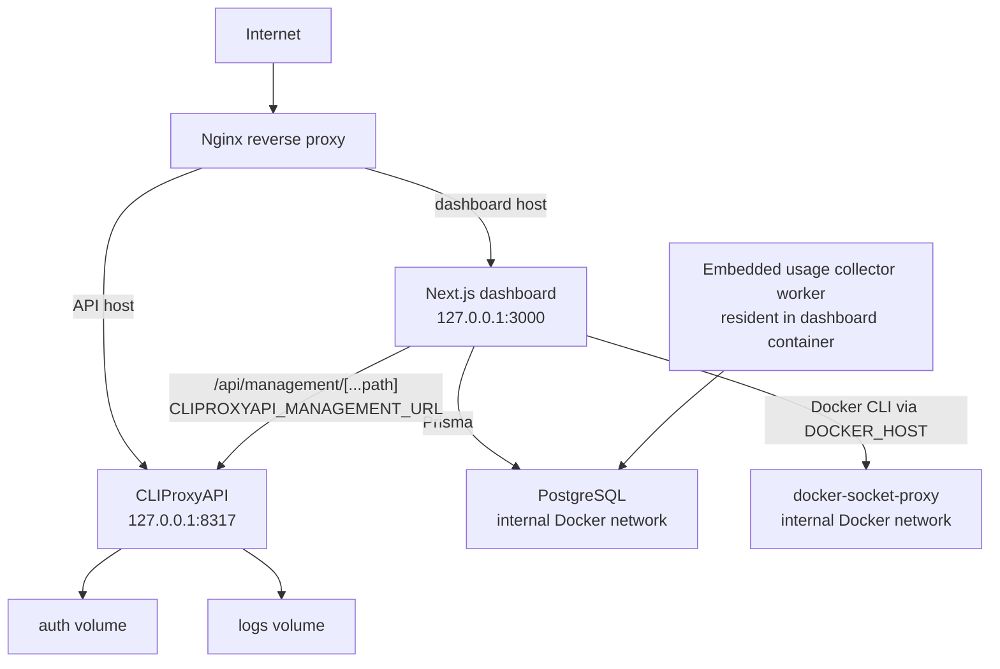

<!-- Updated: 2026-04-12 -->
# Architecture

Canonical docs hub: [`docs/README.md`](README.md)

## Stack

Next.js 16.1.6 + React 19.2.4 + TypeScript 5.9 + Tailwind CSS 4 + Prisma 7 + PostgreSQL 16

## System Diagram



## Public Traffic Split

- The dashboard UI and its authenticated `/api/*` routes live behind the dashboard hostname and terminate in the Next.js service.
- OpenAI-compatible inference traffic lives behind the API hostname and terminates directly in CLIProxyAPI.
- The dashboard does not sit on the hot path for `/v1/*` inference traffic in the current architecture.
- The repo ships [`../infrastructure/nginx/cliproxyapi-dashboard.http.conf.template`](../infrastructure/nginx/cliproxyapi-dashboard.http.conf.template) for this split-host ingress pattern.

## Deployment Boundaries

- **Dashboard (`apps/dashboard/`)**
  - Next.js UI and API routes
  - JWT session auth
  - Prisma access to PostgreSQL
  - provider ownership and custom-provider orchestration
  - update and container-operation control plane
- **Runtime stack (`infrastructure/`)**
  - bundled Docker Compose deployment
  - loopback-bound dashboard and proxy API
  - internal PostgreSQL network
  - `manage.sh` for runtime control plus backup and restore operations
  - webhook helpers

## Current Source Layout

```text
apps/dashboard/src/
├── app/                App Router pages and API handlers
│   ├── api/            authenticated/admin/runtime route handlers
│   └── dashboard/      authenticated dashboard surfaces
├── components/         shared UI building blocks
├── features/           feature-scoped UI and domain modules
├── lib/                shared utilities, clients, and React hooks
└── server/             server-only auth, db, jobs, and usage services
    ├── auth/           session and origin-validation helpers
    ├── db/             Prisma client and generated output
    │   └── generated/  generated Prisma client under db ownership
    └── jobs/           resident usage collector runtime
```

## Frontend Surface

### Page Tree

```text
/
├── /login
├── /setup
└── /dashboard
    ├── /
    ├── /providers
    │   └── /oauth
    │       ├── /connect
    │       └── /model-alias
    ├── /api-keys
    ├── /usage
    ├── /quota
    ├── /config
    ├── /settings
    ├── /monitoring
    ├── /logs
    ├── /containers
    ├── /setup
    └── /admin
        ├── /users
        └── /logs
```

### Main Surfaces

- `DashboardOverviewPage`: overall health, usage summary, model catalog, quick links
- `ProvidersPage`: provider API keys, OAuth accounts, custom providers, provider admin settings
- `ApiKeysPage`: dashboard-issued client credentials
- `UsagePage`: persistent usage analytics based on `GET /api/usage/history`
- `QuotaPage`: provider quota aggregation and capacity windows
- `ConfigPage`: managed CLIProxyAPI runtime settings and YAML preview
- `SettingsPage`: password changes, session revoke, proxy update, dashboard update, deploy flow
- `DashboardSetupPage`: authenticated onboarding checklist after login
- `MonitoringPage`: proxy health, usage polling, live logs, restart actions
- `LogsPage`: log-focused monitoring entry
- `ContainersPage`: allowlisted container inspection and actions
- `AdminUsersPage`: user and role management
- `AdminLogsPage`: audit log review
- `OAuthConnectPage` and `OAuthModelAliasPage`: provider connect/model-alias workflows

## Backend Surface

The 48 route handlers fall into these groups.

### Auth and Setup

- `/api/auth/*` for login, logout, password change, and current-session lookups
- `/api/setup` for first-admin bootstrap
- `/api/setup-status` for post-login onboarding state

### Admin

- `/api/admin/users`
- `/api/admin/settings`
- `/api/admin/logs`
- `/api/admin/deploy`
- `/api/admin/revoke-sessions`
- `/api/admin/migrate-api-keys`

### Provider and Ownership Management

- `/api/user/api-keys`
- `/api/providers/keys`
- `/api/providers/oauth/*`
- `/api/custom-providers/*`
- `/api/provider-groups/*`
- `/api/model-preferences`
- `/api/management/oauth-callback`

### Proxy Runtime and Operations

- `/api/management/[...path]` as the management API passthrough layer
- `/api/proxy/status`
- `/api/proxy/oauth-settings`
- `/api/restart`
- `/api/containers/*`
- `/api/update`
- `/api/update/check`
- `/api/update/dashboard/check`
- `/api/health`

### Usage and Quota

- `/api/quota`
- `/api/usage/collect` as an authenticated fast wake/trigger seam for the resident worker
- `/api/usage/history`
- `/api/usage` as a deprecated compatibility route

## Data Model Summary

```text
User
  ├── UserApiKey
  ├── ProviderKeyOwnership
  ├── ProviderOAuthOwnership
  ├── CustomProvider
  ├── ProviderGroup
  ├── ModelPreference
  ├── AuditLog
  └── UsageRecord

CustomProvider
  ├── CustomProviderModel
  └── CustomProviderExcludedModel

SystemSetting
CollectorState
```

- `User`: dashboard identity, admin role, session invalidation via `sessionVersion`
- `UserApiKey`: dashboard-issued client API keys
- `ProviderKeyOwnership`: direct provider-key ownership mapping
- `ProviderOAuthOwnership`: OAuth account ownership mapping
- `ModelPreference`: per-user excluded model preferences
- `CustomProvider`: user-managed OpenAI-compatible upstream definition
- `ProviderGroup`: grouping, ordering, and activation state for custom providers
- `SystemSetting`: global dashboard settings such as provider-key limits
- `AuditLog`: admin and security trail
- `UsageRecord`: persistent usage facts collected from CLIProxyAPI
- `CollectorState`: runtime metadata for collector leadership, trigger overlap, and progress visibility

## Runtime Dependencies

### External Services and Images

- **CLIProxyAPI** (`eceasy/cli-proxy-api:latest`, upstream `router-for-me/CLIProxyAPI`) for proxy runtime and management API
- **PostgreSQL 16** (`postgres:16-alpine`) for persistent storage
- **Docker socket proxy** (`tecnativa/docker-socket-proxy:latest`) for restricted Docker API access
- **GHCR dashboard image** (`ghcr.io/<repo>/dashboard`) for published dashboard builds

### Internal Modules Worth Knowing

- `lib/api-endpoints.ts`: shared route constants
- `lib/errors.ts`: canonical API response helpers
- `lib/env.ts`: env schema and validation
- `lib/proxy-runtime.ts`: proxy container and compose-path resolution
- `lib/providers/management-api.ts`: management API wrapper and process-local mutex
- `lib/usage/history.ts`: persistent usage snapshot and aggregation logic
- `features/containers/containers.ts`: allowlist for container management
- `server/auth/lib/origin.ts`: effective-origin validation for state-changing authenticated requests

## Runtime Notes

- The production dashboard image runs [`../apps/dashboard/scripts/runtime/entrypoint.sh`](../apps/dashboard/scripts/runtime/entrypoint.sh), which applies the baseline Prisma migration chain with `prisma migrate deploy` before starting the server.
- Source development uses the same baseline migration chain with `prisma migrate deploy`.
- The Docker stack itself does not include a public ingress service. The repo ships an optional Nginx template, and `install.sh` can install Nginx as an HTTP reverse proxy starter outside the Compose stack.
- The bundled deployment assumes a single dashboard instance.
- `providerMutex` in [`../apps/dashboard/src/lib/providers/management-api.ts`](../apps/dashboard/src/lib/providers/management-api.ts) is process-local only.
- [`../apps/dashboard/prisma/schema.prisma`](../apps/dashboard/prisma/schema.prisma) is the active source of truth for the data model.

## Auth Model

```text
setup/login
  -> hash password with bcrypt
  -> sign JWT with jose
  -> store session cookie
  -> verify JWT on server
  -> invalidate globally via users.sessionVersion
```
