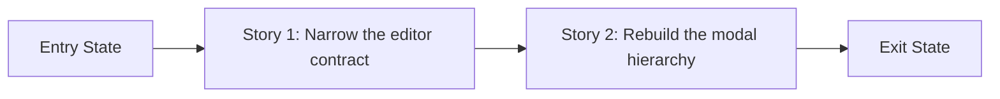

# Story Map: Phase 1 - Clear OAuth Settings Editing

**Date**: 2026-05-04
**Phase Plan**: `history/oauth-config-ui-ux/phase-plan.md`
**Phase Contract**: `history/oauth-config-ui-ux/phase-1-contract.md`

## 1. Story Dependency Diagram

## 2. Story Execution Structure
| Story | Mode | Depends On | Blocks | Shared Risk | Why Safe |
|------|------|------------|--------|-------------|----------|
| Story 1: Narrow the editor contract | Serial | Entry state only | Story 2 | Shared files: `dashboard/src/lib/providers/oauth-auth-file-settings.ts`, `dashboard/src/components/providers/oauth-section.tsx` | Safe because it stabilizes the data contract before any visual rebuild depends on it. |
| Story 2: Rebuild the modal hierarchy | Serial | Story 1 | Phase 1 exit state | Shared files: `dashboard/src/components/providers/oauth-account-settings-modal.tsx`, `dashboard/src/components/providers/oauth-section.tsx` | Safe because it consumes the final field surface rather than carrying compatibility code for removed fields. |

## 3. Story Table
| Story | What Happens | Why Now | Contributes To | Creates | Unlocks | Done Looks Like |
|------|---------------|---------|----------------|---------|---------|-----------------|
| Story 1: Narrow the editor contract | The editor model drops removed advanced fields, adds `headers` validation state, and keeps full-file preview/save semantics intact. | The modal should not be restyled around a field surface that is being replaced. | Exit-state items 1 and 3 | Stable editor contract for Phase 1 | Story 2 | `br-wpd.1` is ready, and the approved fields are the only editable contract left. |
| Story 2: Rebuild the modal hierarchy | The modal becomes a split layout with stronger section hierarchy and the approved editable surface. | It relies on Story 1 to know the final editable controls and validation behavior. | Exit-state items 2 and 4 | Final user-visible Phase 1 surface | Validation handoff | `br-wpd.2` is ready, and the modal visually matches D9 through D13. |

## 4. Story Details
### Story 1: Narrow the editor contract
- **What Happens In This Story**: `dashboard/src/lib/providers/oauth-auth-file-settings.ts` is reshaped to the approved field model, and `dashboard/src/components/providers/oauth-section.tsx` consumes that reshaped model without restoring removed fields.
- **Why Now**: It removes contract churn before layout work and ensures the modal preview/save surface is built on final semantics.
- **Execution Mode (+ parallel safety)**: Serial. This story touches the source-of-truth editor model and the modal orchestrator, so parallel work would create avoidable collisions.
- **Contributes To**: Phase 1 exit-state items 1 and 3.
- **Creates**: A validation-aware `headers` editing contract and a narrowed payload builder.
- **Unlocks**: Story 2 and all downstream modal rendering work.
- **Shared File/Context Risk**: High local collision risk inside `oauth-auth-file-settings.ts` and `oauth-section.tsx`, but bounded by serial execution.
- **Done Looks Like**: Only `prefix`, `proxyUrl`, `priority`, `headers`, and `note` remain in the editor contract, and invalid `headers` JSON blocks save readiness.
- **Candidate Bead Themes**: `br-wpd.1`
- **Testing Discipline Hint**: Focused editor-model verification plus dashboard typecheck/lint.

### Story 2: Rebuild the modal hierarchy
- **What Happens In This Story**: `dashboard/src/components/providers/oauth-account-settings-modal.tsx` is restructured into the approved split layout, and `dashboard/src/components/providers/oauth-section.tsx` wires the updated field props through the unchanged load/save lifecycle.
- **Why Now**: The UI should only be rebuilt once Story 1 defines the final editable surface and validation state.
- **Execution Mode (+ parallel safety)**: Serial. This story overlaps `oauth-section.tsx` and depends on Story 1’s final prop contract.
- **Contributes To**: Phase 1 exit-state items 2 and 4.
- **Creates**: The final user-facing modal hierarchy for Phase 1.
- **Unlocks**: Validation handoff for Phase 1 and the eventual Phase 2 card entry point.
- **Shared File/Context Risk**: Moderate overlap in `oauth-section.tsx`; low risk elsewhere if Story 1 lands first.
- **Done Looks Like**: The modal clearly separates editing from informational preview content, keeps the approved fields only, and preserves load/error/save affordances.
- **Candidate Bead Themes**: `br-wpd.2`
- **Testing Discipline Hint**: Focused modal-flow verification plus dashboard typecheck/lint.

## 5. Story Order + Parallelism Check
- [x] Story order is causally justified
- [x] Parallel claims include collision controls
- [x] Story completion implies phase exit state

## 6. Story-To-Bead Mapping (post bead creation)
| Story | Beads | Shared Risk Notes | Test Discipline Needed |
|------|-------|-------------------|------------------------|
| Story 1: Narrow the editor contract | `br-wpd.1` | Serial-first because it rewrites the editor contract consumed by the modal orchestrator. | Focused editor-model verification, then `cd dashboard && npm run typecheck` and `cd dashboard && npm run lint` |
| Story 2: Rebuild the modal hierarchy | `br-wpd.2` | Depends on `br-wpd.1` and reuses `oauth-section.tsx`, so execute after Story 1 to avoid prop churn. | Focused modal-flow verification, then `cd dashboard && npm run typecheck` and `cd dashboard && npm run lint` |
