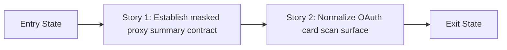

# Story Map: Phase 2 - Scan-Ready OAuth Account Cards

**Date**: 2026-05-04
**Phase Plan**: `history/oauth-config-ui-ux/phase-plan.md`
**Phase Contract**: `history/oauth-config-ui-ux/phase-2-contract.md`

## 1. Story Dependency Diagram

## 2. Story Execution Structure
| Story | Mode | Depends On | Blocks | Shared Risk | Why Safe |
|------|------|------------|--------|-------------|----------|
| Story 1: Establish masked proxy summary contract | Serial | Entry state only | Story 2 | Shared files: `dashboard/src/lib/providers/oauth-ops.ts`, `dashboard/src/lib/providers/management-api.ts`, `dashboard/src/app/api/providers/oauth/route.ts`, `dashboard/src/lib/__tests__/oauth-ops.test.ts` | Safe because `br-wpd.6` already closed the only HIGH-risk question and execution now just needs to encode that bounded contract before UI work consumes it. |
| Story 2: Normalize OAuth card scan surface | Serial | Story 1 | Phase 2 exit state | Shared files: `dashboard/src/components/providers/oauth-credential-list.tsx`, `dashboard/src/components/providers/oauth-section.tsx` | Safe because it consumes a finalized additive contract and keeps the user-visible changes in one card/UI pass. |

## 3. Story Table
| Story | What Happens | Why Now | Contributes To | Creates | Unlocks | Done Looks Like |
|------|---------------|---------|----------------|---------|---------|-----------------|
| Story 1: Establish masked proxy summary contract | The list route and server helpers lock how custom proxy override information reaches the card grid as an optional masked display-only field. | The UI should not guess a contract that was previously HIGH-risk and now has a spike-backed answer. | Exit-state item 1 | Stable additive proxy summary contract for Phase 2 | Story 2 | `br-wpd.6` exists, `br-wpd.4` is ready, and card consumers can only see masked display strings or no proxy data at all. |
| Story 2: Normalize OAuth card scan surface | The card component adopts `Limit Reached`, softer detail messaging, the approved action order, explicit `Config`, and masked proxy badge rendering. | It relies on Story 1 to know when and how proxy display data is safe to render. | Exit-state items 2 through 5 | Final user-visible Phase 2 surface | Validation handoff | `br-wpd.5` is ready, and the grid matches D2 through D8 without expanding product scope. |

## 4. Story Details
### Story 1: Establish masked proxy summary contract
- **What Happens In This Story**: `br-wpd.6` proves the safe path, then `dashboard/src/lib/providers/oauth-ops.ts`, `dashboard/src/lib/providers/management-api.ts`, and `dashboard/src/app/api/providers/oauth/route.ts` encode the additive contract where repeated `maskedProxyFor` query params request bounded enrichment and `dashboard/src/lib/__tests__/oauth-ops.test.ts` locks masking and omission behavior.
- **Why Now**: The only HIGH-risk question is now answered YES, so execution can lock the bounded route contract before any UI depends on it.
- **Execution Mode (+ parallel safety)**: Serial. Even with the spike closed, this story still changes the shared server contract and type surface, so UI work should not begin until the final prop shape is stable.
- **Contributes To**: Phase 2 exit-state item 1.
- **Creates**: A server-owned proxy badge contract that never exposes raw credentials and never enriches the full list by default.
- **Unlocks**: Story 2 and the final grid UI pass.
- **Shared File/Context Risk**: Moderate local risk around type, route, and test alignment; bounded because the spike already removed the architecture guesswork.
- **Done Looks Like**: `GET /api/providers/oauth` remains metadata-only unless `maskedProxyFor` is present, enrichment is capped at 12 unique account names, and `maskedProxyUrl` is returned only for safe custom overrides.
- **Candidate Bead Themes**: `br-wpd.6`, `br-wpd.4`
- **Testing Discipline Hint**: `tdd-required`; run focused `oauth-ops` tests first, then dashboard verification commands sequentially.

### Story 2: Normalize OAuth card scan surface
- **What Happens In This Story**: `dashboard/src/components/providers/oauth-credential-list.tsx` and `dashboard/src/components/providers/oauth-section.tsx` consume the additive summary contract, reserve `Limit Reached` for usage-limit cases only, keep other provider errors in the lower detail panel, and adopt the approved action order plus explicit `Config` affordance.
- **Why Now**: The grid should only be rebuilt once the safe proxy-summary contract exists and the modal entry point is already stable from Phase 1.
- **Execution Mode (+ parallel safety)**: Serial. This story overlaps the card component and the section-level data flow, and it depends on Story 1’s final contract.
- **Contributes To**: Phase 2 exit-state items 2 through 5.
- **Creates**: The final scan-ready OAuth card surface.
- **Unlocks**: Validation handoff for Phase 2 and feature-complete UAT.
- **Shared File/Context Risk**: Moderate overlap inside the card component; bounded because the route contract is already settled first.
- **Done Looks Like**: The badge row is limited to `Active`, `Disabled`, and usage-limit `Limit Reached`, non-limit errors stay below the stats area, custom proxy accounts show masked badges only when `maskedProxyUrl` exists, and `Config` is a text-labeled action in the approved order.
- **Candidate Bead Themes**: `br-wpd.5`
- **Testing Discipline Hint**: Focused grid-flow manual verification plus dashboard typecheck and lint.

## 5. Story Order + Parallelism Check
- [x] Story order is causally justified
- [x] Parallel claims include collision controls
- [x] Story completion implies phase exit state

## 6. Story-To-Bead Mapping (post bead creation)
| Story | Beads | Shared Risk Notes | Test Discipline Needed |
|------|-------|-------------------|------------------------|
| Story 1: Establish masked proxy summary contract | `br-wpd.6`, `br-wpd.4` | Execute `br-wpd.6` findings first, then implement the exact bounded contract in `br-wpd.4`; keep `management-api.ts` and the route contract aligned. | Focused `oauth-ops` regression coverage, then sequential dashboard verification commands |
| Story 2: Normalize OAuth card scan surface | `br-wpd.5` | Depends on `br-wpd.4` and reuses `oauth-section.tsx`, so keep it after Story 1 to avoid prop churn. | Focused card-grid verification, then dashboard typecheck and lint |
